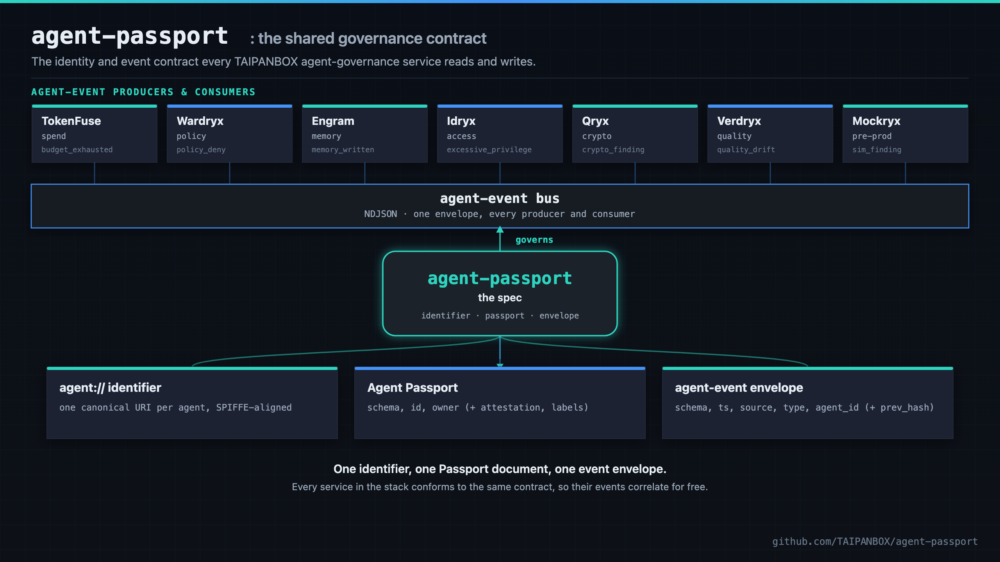
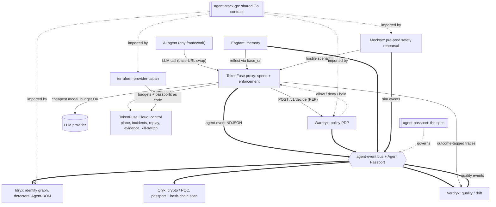
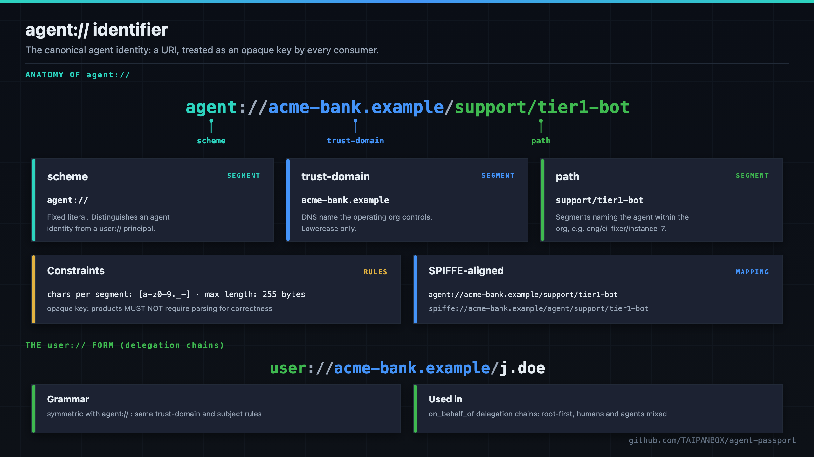
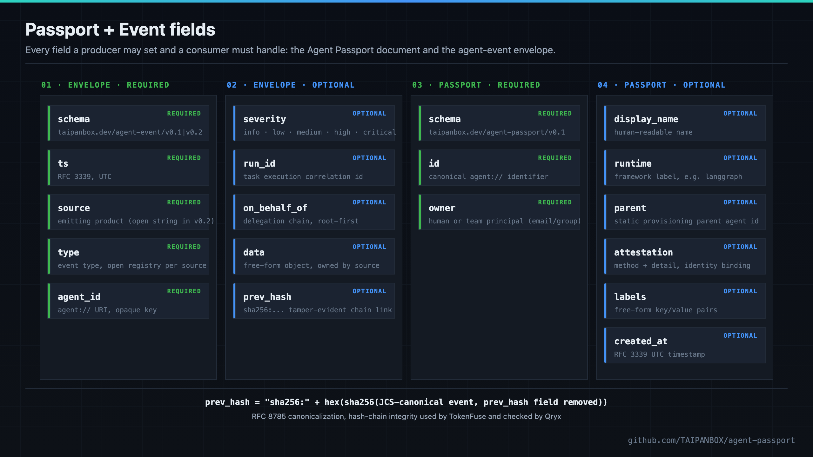

<div align="center">

# agent-passport: Shared Identity & Event Contract

**The thinnest possible shared fabric for AI-agent governance: one identifier, one delegation chain, one event envelope.**

[](https://github.com/TAIPANBOX/agent-passport/actions/workflows/ci.yml)




</div>

Agent Passport is the thinnest possible shared fabric for AI-agent
governance tooling: **one identifier, one delegation chain, one event
envelope.** No shared runtime, no shared database, no new service:
adopting it is a naming agreement plus, at most, a few optional fields.
It is a specification repo, not a running service; conformance is a
matter of a product's own code accepting the ID, emitting the envelope,
and propagating the delegation chain.

---

## Why

AI-agent governance splits into four planes, each owned by a different
kind of tool:

| Plane | Concern |
|---|---|
| Spend | budget, cost, runaway/loop detection |
| Memory | what an agent knows, how it decays, contradictions |
| Access | identity, privilege, delegation, anomaly detection |
| Crypto | signed evidence, attestation, tamper-evident trails |

Tools on each plane are complete on their own, but without a shared agent
identifier and a shared event shape, they cannot be correlated. This spec
defines just enough to make that possible: a canonical `agent://` ID
(§3), an optional Passport document describing an agent (§4), an ordered
delegation chain (§5), and a common event envelope for what products say
about an agent (§6). See [`SPEC.md`](./SPEC.md) for the full, normative
specification, including non-goals (§2), conformance criteria (§7), and
the resolved design decisions (§8).

---

## Where this fits in the stack

agent-passport is the spec plane of the TAIPANBOX agent-governance stack: it defines the `agent://` identity and the agent-event NDJSON contract every other service implements or binds to.



- **Consumes**: nothing upstream; it is the canonical spec every service reads.
- **Produces**: the `agent://` / `user://` identifier grammar, the Agent Passport document schema, and the agent-event envelope schema (`taipanbox.dev/agent-event/v0.2`).
- **Talks to**: governs every service in the stack; **agent-stack-go** is its Go binding, and Rust (**TokenFuse**) and Python (**Engram**, **Verdryx**) carry their own bindings validated against the same schema.

The full stack is TokenFuse (spend), Wardryx (policy), Engram (memory), Idryx (access), Qryx (crypto), Verdryx (quality), Mockryx (pre-prod), on the shared Agent Passport + agent-event contract (agent-stack-go / agent-passport), configured via terraform-provider-taipan.

## Live infrastructure validation

Agent Passport has no dashboard of its own - but its envelope and delegation-chain format was
load-bearing in every live infrastructure campaign run across the stack before public launch, including
under a 34-agent concurrent burst on a real raft-replicated gateway.

Full write-up: [`VALIDATION.md`](VALIDATION.md).

---

## The `agent://` identifier

<div align="center">

</div>

An agent ID is a URI, mechanically aligned with SPIFFE
(`spiffe://acme-bank.example/agent/support/tier1-bot`) without requiring
SPIFFE infrastructure:

```
agent://<trust-domain>/<path>
```

| Segment | Rule | Example |
|---|---|---|
| `<trust-domain>` | a DNS name the operating org controls, lowercase | `acme-bank.example` |
| `<path>` | one or more segments naming the agent within the org | `support/tier1-bot` |
| chars per segment | `[a-z0-9._-]` | |
| max total length | 255 bytes | |

Products MUST treat the ID as an opaque string key (no parsing required
for correctness); products MAY parse it for display grouping. Organizations
already running SPIRE SHOULD derive the Passport ID from the SVID rather
than mint a parallel namespace.

| Product | Binding |
|---|---|
| TokenFuse | the value of `x-fuse-agent-id`; `agent_id` column in Parquet traces; budget-hierarchy key |
| Engram | the `agent_id` memory scope; multi-agent ACLs (future) reference these IDs |
| Idryx | `Identity.ID` for `IdentityAgent` nodes ingested from Passport-aware sources |
| Qryx | the `subject` of evidence entries covering agent infrastructure |

### Humans in the chain: `user://`

Symmetric with `agent://`, parsed by the same rules:

```
user://<trust-domain>/<subject>
```

Used in the **delegation chain** (`on_behalf_of`): an ordered list,
root first, mixing `agent://` and `user://` entries. The last entry is
the immediate principal; the first is the root (usually a human). An
empty/absent chain means the agent acts autonomously. Products MUST NOT
truncate the chain when forwarding; a sub-agent appends exactly one
entry (its spawner) to the chain it received. The chain MUST be acyclic:
a service refuses to forward a chain that already contains its own
principal, and maximum chain depth is 32 entries (SPEC.md §5.1).

---

## The Passport document and the event envelope

<div align="center">

</div>

### Passport document

Optional metadata describing one agent, not a token: nothing at runtime
depends on fetching it. Schema:
[`schemas/agent-passport.schema.json`](./schemas/agent-passport.schema.json).

```json
{
  "schema": "taipanbox.dev/agent-passport/v0.1",
  "id": "agent://acme-bank.example/support/tier1-bot",
  "display_name": "Tier-1 support bot",
  "owner": "team-support@acme-bank.example",
  "runtime": "langgraph",
  "parent": "agent://acme-bank.example/support/orchestrator",
  "attestation": {
    "method": "spiffe-svid",
    "detail": "spiffe://acme-bank.example/agent/support/tier1-bot"
  },
  "labels": { "env": "prod", "cost_center": "cs-eu" },
  "created_at": "2026-07-09T00:00:00Z"
}
```

| Field | Required | Notes |
|---|---|---|
| `schema` | yes | const `taipanbox.dev/agent-passport/v0.1` |
| `id` | yes | canonical `agent://` identifier |
| `owner` | yes | human or team principal (email or group); the auditor's first question, "whose agent is this?" |
| `display_name` | no | human-readable name |
| `runtime` | no | free-form label for the agent runtime/framework, e.g. `langgraph` |
| `parent` | no | static provisioning parent agent ID, distinct from the dynamic `on_behalf_of` chain |
| `attestation.method` | no | one of `none` · `oidc` · `spiffe-svid` · `enclave-key` · `mtls-cert`; `none` is legal and honest, the field exists so the posture is visible |
| `attestation.detail` | no | method-specific reference, e.g. a SPIFFE ID or issuer URL |
| `labels` | no | free-form key/value pairs, e.g. `env`, `cost_center` |
| `created_at` | no | RFC 3339 UTC timestamp |

### Event envelope

One JSON object per event, NDJSON when batched. Schema:
[`schemas/agent-event.schema.json`](./schemas/agent-event.schema.json)
(v0.1) and
[`schemas/agent-event.v0.2.schema.json`](./schemas/agent-event.v0.2.schema.json).
The `type` registry is open per source (SPEC.md §6.2); the envelope
itself is fixed.

```json
{
  "schema": "taipanbox.dev/agent-event/v0.1",
  "ts": "2026-07-09T03:12:44.100Z",
  "source": "tokenfuse",
  "type": "budget_exhausted",
  "severity": "critical",
  "agent_id": "agent://acme-bank.example/support/tier1-bot",
  "run_id": "run-8842",
  "on_behalf_of": ["user://acme-bank.example/j.doe"],
  "data": { "budget_usd": 2.00, "spent_usd": 2.00, "action": "blocked_402" },
  "prev_hash": "sha256:..."
}
```

| Field | Required | Notes |
|---|---|---|
| `schema` | yes | `taipanbox.dev/agent-event/v0.1` or `/v0.2` |
| `ts` | yes | RFC 3339, UTC |
| `source` | yes | emitting product; closed enum in v0.1, open string (`minLength: 1`) in v0.2 |
| `type` | yes | event type, open registry per source, additive without a schema bump |
| `agent_id` | yes | `agent://` URI, opaque key |
| `severity` | no | `info` · `low` · `medium` · `high` · `critical` |
| `run_id` | no | task execution correlation ID |
| `on_behalf_of` | no | delegation chain, root first |
| `data` | no | free-form object, owned by the `source` product; consumers MUST ignore unknown keys |
| `prev_hash` | no | present when the emitting product maintains a tamper-evident chain; format `^sha256:[0-9a-f]{64}$` |

Unknown top-level fields MUST be ignored (forward compatibility). Where
present, `prev_hash` is computed as `"sha256:" + hex(sha256(C))`, where
`C` is the RFC 8785 (JSON Canonicalization Scheme) canonical serialization
of the event object with the `prev_hash` field itself removed
(SPEC.md §6.5).

Registered sources today:

| `source` | Product | Representative `type` values |
|---|---|---|
| `tokenfuse` | spend governance | `budget_exhausted` · `sustained_loop` · `spend_spike` · `fanout_explosion` · `breaker_tripped` · `dlp_block` · `taint_block` · `mcp_drift` |
| `engram` | memory governance | `memory_written` · `reflection_run` · `contradiction_found` · `memory_forgotten` |
| `idryx` | identity and access governance | `excessive_privilege` · `behavior_anomaly` · `impossible_travel` · `mfa_fatigue` · `new_device` · `blast_radius_change` · `attestation_missing` |
| `qryx` | cryptographic evidence | `crypto_finding` · `crypto_drift` · `policy_violation` · `evidence_signed` |
| `wardryx` | policy and approval gating (wave 2) | `policy_allow` (info) · `policy_deny` (high) · `approval_requested` (medium) · `approval_granted` (info) · `approval_denied` (high) · `approval_timeout` (high) |
| `verdryx` | evaluation and quality drift (wave 2) | `eval_run` (info) · `quality_score` (info) · `quality_drift` (high) |
| `mockryx` | simulation and blast-radius testing (wave 2) | `sim_run` (info) · `sim_finding` (high) · `blast_radius_measured` (medium) |

The first four TokenFuse types are its existing incident taxonomy
verbatim, zero renaming. Consumers MUST accept events whose `schema` is
either `/v0.1` or `/v0.2`; existing emitters may keep emitting v0.1, new
wave-2 services emit v0.2. The two versions differ only in the `source`
field (SPEC.md §6.4).

### Conformance

A product is Passport-aware per SPEC.md §7 when it:

1. Accepts an `agent://` URI wherever it takes an agent identifier today, treating it as an opaque key.
2. Emits its agent-relevant events in the envelope above (natively or via an exporter).
3. Propagates `on_behalf_of` without truncation where it forwards requests.

Deliberately *not* required: reading Passport documents. A consumer of
IDs and events alone is already useful.

---

## Repo layout

```
SPEC.md                              normative specification
schemas/agent-passport.schema.json   JSON Schema (draft 2020-12) for §4
schemas/agent-event.schema.json      JSON Schema (draft 2020-12) for §6, v0.1
schemas/agent-event.v0.2.schema.json JSON Schema (draft 2020-12) for §6, v0.2
examples/passport.json               example Passport document
examples/events.ndjson               example events, one per source
```

---

## Adoption status

_as of 2026-07-12_

| Product | Status | What shipped |
|---|---|---|
| Engram | shipped | MCP server accepts `agent://` IDs as an opaque `agent_id` scope; opt-in agent-event NDJSON exporter (`memory_written` · `reflection_run` · `contradiction_found` · `memory_forgotten`), shipped on main since v2.2.0, not yet in a tagged release |
| Idryx | shipped | delegation chains (root-first, cycle-safe); generic agent-event-bus connector ingesting TokenFuse/Wardryx/Mockryx/Verdryx NDJSON, one loader deriving `source` from each envelope rather than the `--source`/`--load` flag that selected it; Passport-document ingestion (`--passports`); spend-correlation detector consuming the envelope; `attestation_missing` detector |
| TokenFuse | shipped | `x-fuse-agent-id` carried; native agent-event exporter and `x-fuse-on-behalf-of` capture shipped on main, not yet in a tagged release |
| Qryx | partial | agent-infra scanning shipped (`qryx agents`, `internal/agentstack`); emitting findings as agent-event not started |
| Wardryx | shipped | wave-2 service; policy/approval gating, event schema v0.2 |
| Verdryx | shipped | wave-2 service; evaluation and quality drift, event schema v0.2 |
| Mockryx | shipped | wave-2 service; simulation and blast-radius testing, event schema v0.2 |

Event schema v0.2 (`schemas/agent-event.v0.2.schema.json`) opens the
`source` field to any string and adds the wave-2 event types; the
Passport schema is unchanged at v0.1. See SPEC.md §6.4 for versioning and
compatibility, and SPEC.md §9 for the per-repo adoption cost estimate.

---

## Status

- [x] canonical `agent://` identifier grammar, SPIFFE-aligned (SPEC.md §3)
- [x] symmetric `user://` principal form for the delegation chain (SPEC.md §8.2)
- [x] Passport document schema v0.1, required + optional fields (SPEC.md §4, `schemas/agent-passport.schema.json`)
- [x] ordered, cycle-safe delegation chain, max depth 32 (SPEC.md §5, §5.1)
- [x] event envelope schema v0.1 and v0.2, `prev_hash` hash-chain canonicalization (SPEC.md §6, `schemas/agent-event*.schema.json`)
- [x] conformance criteria (SPEC.md §7) and resolved design decisions (SPEC.md §8)
- [x] adopted across the original four (TokenFuse, Engram, Idryx shipped; Qryx partial) plus wave-2 (Wardryx, Verdryx, Mockryx shipped)
- [ ] Qryx: emitting findings as agent-event (agent-infra scanning is done; the emitter is not started)
- [ ] a standalone conformance-check CLI/validator (today, conformance is verified per-repo against the JSON Schemas by hand)

## License

Apache License 2.0, see [`LICENSE`](./LICENSE). Copyright 2026 TAIPANBOX.
