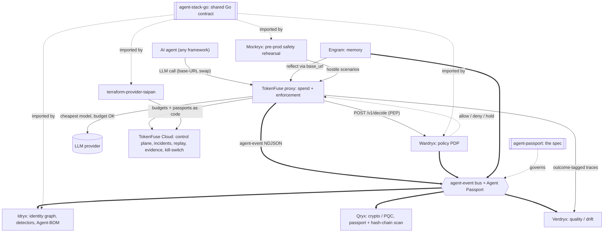

# Agent Passport

**Version:** 0.1 · **Status:** accepted, adoption in progress · **License:** Apache-2.0

Agent Passport is the thinnest possible shared fabric for AI-agent
governance tooling: **one identifier, one delegation chain, one event
envelope.** No shared runtime, no shared database, no new service —
adopting it is a naming agreement plus, at most, a few optional fields.

## Why

AI-agent governance splits into four planes, each owned by a different
kind of tool:

| Plane | Concern |
|---|---|
| Spend | budget, cost, runaway/loop detection |
| Memory | what an agent knows, how it decays, contradictions |
| Access | identity, privilege, delegation, anomaly detection |
| Crypto | signed evidence, attestation, tamper-evident trails |

Tools on each plane are complete on their own, but without a shared agent
identifier and a shared event shape, they cannot be correlated. This spec
defines just enough to make that possible: a canonical `agent://` ID
(§3), an optional Passport document describing an agent (§4), an ordered
delegation chain (§5), and a common event envelope for what products say
about an agent (§6).

See [`SPEC.md`](./SPEC.md) for the full, normative specification,
including non-goals (§2), conformance criteria (§7), and the resolved
design decisions (§8).

## Where this fits in the stack

agent-passport is the spec plane of the TAIPANBOX agent-governance stack: it defines the `agent://` identity and the agent-event NDJSON contract every other service implements or binds to.



- **Consumes**: nothing upstream; it is the canonical spec every service reads.
- **Produces**: the `agent://` / `user://` identifier grammar, the Agent Passport document schema, and the agent-event envelope schema (`taipanbox.dev/agent-event/v0.2`).
- **Talks to**: governs every service in the stack; **agent-stack-go** is its Go binding, and Rust (**TokenFuse**) and Python (**Engram**, **Verdryx**) carry their own bindings validated against the same schema.

The full stack is TokenFuse (spend), Wardryx (policy), Engram (memory), Idryx (access), Qryx (crypto), Verdryx (quality), Mockryx (pre-prod), on the shared Agent Passport + agent-event contract (agent-stack-go / agent-passport), configured via terraform-provider-taipan.

## The identifier

```
agent://<trust-domain>/<path>
```

e.g. `agent://acme-bank.example/support/tier1-bot`. Mechanically aligned
with SPIFFE (`spiffe://acme-bank.example/agent/support/tier1-bot`)
without requiring SPIFFE infrastructure. Full grammar in SPEC.md §3.1.

## The Passport document

Optional metadata describing one agent — not a token, nothing at runtime
depends on fetching it. Schema: [`schemas/agent-passport.schema.json`](./schemas/agent-passport.schema.json).

```json
{
  "schema": "taipanbox.dev/agent-passport/v0.1",
  "id": "agent://acme-bank.example/support/tier1-bot",
  "display_name": "Tier-1 support bot",
  "owner": "team-support@acme-bank.example",
  "runtime": "langgraph",
  "parent": "agent://acme-bank.example/support/orchestrator",
  "attestation": {
    "method": "spiffe-svid",
    "detail": "spiffe://acme-bank.example/agent/support/tier1-bot"
  },
  "labels": { "env": "prod", "cost_center": "cs-eu" },
  "created_at": "2026-07-09T00:00:00Z"
}
```

## The event envelope

One JSON object per event, NDJSON when batched. Schema:
[`schemas/agent-event.schema.json`](./schemas/agent-event.schema.json).
The `type` registry is open per source (SPEC.md §6.2); the envelope
itself is fixed.

```json
{
  "schema": "taipanbox.dev/agent-event/v0.1",
  "ts": "2026-07-09T03:12:44.100Z",
  "source": "tokenfuse",
  "type": "budget_exhausted",
  "severity": "critical",
  "agent_id": "agent://acme-bank.example/support/tier1-bot",
  "run_id": "run-8842",
  "on_behalf_of": ["user://acme-bank.example/j.doe"],
  "data": { "budget_usd": 2.00, "spent_usd": 2.00, "action": "blocked_402" },
  "prev_hash": "sha256:..."
}
```

## Repo layout

```
SPEC.md                         normative specification
schemas/agent-passport.schema.json   JSON Schema (draft 2020-12) for §4
schemas/agent-event.schema.json      JSON Schema (draft 2020-12) for §6
examples/passport.json               example Passport document
examples/events.ndjson               example events, one per source
```

## Conformance

A product is Passport-aware per SPEC.md §7 when it accepts `agent://`
IDs as opaque keys, emits its events in the §6 envelope, and propagates
`on_behalf_of` without truncation. Reading Passport documents is
explicitly not required.

## Scope

Adopted across the TAIPANBOX agent-governance stack: TokenFuse (spend),
Engram (memory), Idryx (access), Qryx (crypto). See SPEC.md §9 for the
per-repo adoption cost.

## Adoption status

_as of 2026-07-09_

| Product | Status | What shipped |
|---|---|---|
| Engram | shipped | MCP server accepts `agent://` IDs as an opaque `agent_id` scope |
| Idryx | shipped | delegation chains (root-first, cycle-safe); TokenFuse NDJSON event connector; Passport-document ingestion (`--passports`); spend-correlation detector consuming the envelope; `attestation_missing` detector |
| TokenFuse | partial | `x-fuse-agent-id` already carried; native agent-event exporter and `x-fuse-on-behalf-of` capture in progress |
| Qryx | not started | agent-infra scanning planned |
| Wardryx | planned | wave-2 service; policy/approval gating, event schema v0.2 |
| Verdryx | planned | wave-2 service; evaluation and quality drift, event schema v0.2 |
| Mockryx | planned | wave-2 service; simulation and blast-radius testing, event schema v0.2 |

Event schema v0.2 (`schemas/agent-event.v0.2.schema.json`) opens the
`source` field to any string and adds the wave-2 event types; the
Passport schema is unchanged at v0.1. See SPEC.md §6.4 for versioning and
compatibility.

## License

Apache License 2.0 — see [`LICENSE`](./LICENSE). Copyright 2026 TAIPANBOX.
